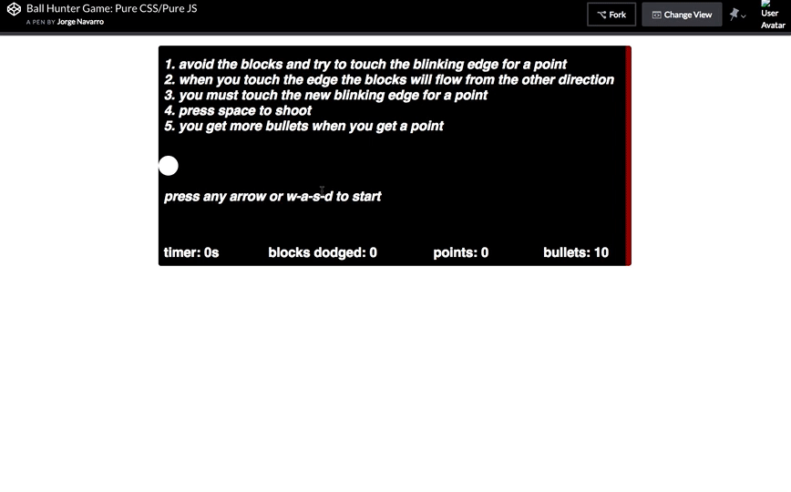
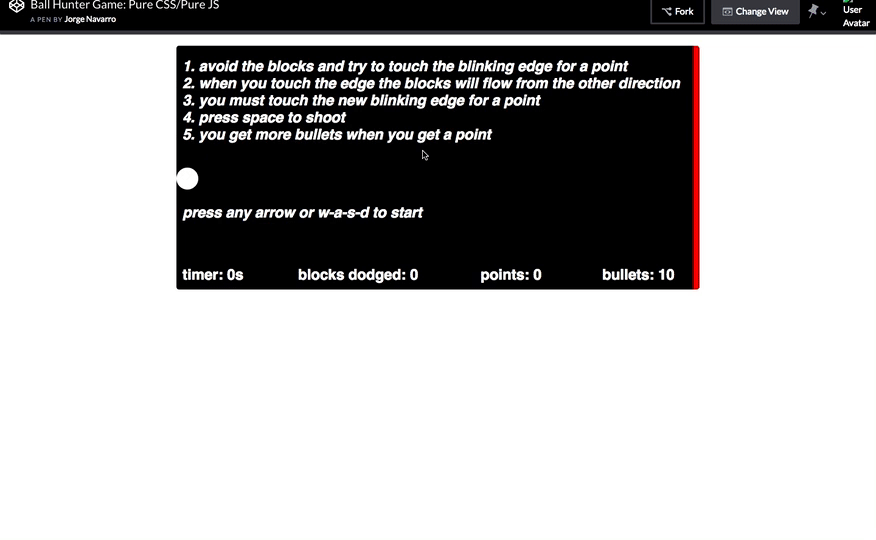

# Ball-Shooting-Game
Hosted here: https://codepen.io/jnavarr56/YjRVwg
### Tools
  - Just JS/CSS/HTML!
  



### Description
This simple yet entertaining game is a basic shooter that relies on entirely on DOM manipulation.
The user is presented with instructions and the game start is triggered by moving any button.
Users play my moving across the screen and reaching alternating ends to get points, all the while shooting
and dodging obstacles that will result in a loss in they touch the user.

The inspiration came from playing around with divs and triggering element creation on keydown events.
### Code Highlights
This game required me to develop a system to check for 2 collisions:
  - between the ball and the obstacles
  - between the obstacles and the bullet
  
The functions responsible for these detections run every every (1/1000000) seconds, ensuring that collisions will definitely be detected despite an infinitesmal lag.

The logic for both detections is more or less the same. I pick one of the elements in the detection and I get its:
  - vertical offset from the top (A)
  - vertical offset from the top + height (A.1)
  - horizontal offset from the left (B)
  - horizontal offset from the left + width (B.1)

Then I do the same for the the other element:
  - vertical offset from the top (C)
  - vertical offset from the top + height (C.1)
  - horizontal offset from the left (D)
  - horizontal offset from the left + width (D.1)

The detection is then: 

  - if A is between C & C.1 and B is between B & B.1
                          OR
  - if A.1 is between C & C.1 and B is between B & B.1
                          OR
  - if A is between C & C.1 and B.1 is between B & B.1
                          OR
  - if A.1 is between C & C.1 and B.1 is between B & B.1
  
then there is a collision!


See below for an example of how I implement this logic:

```javascript
let collisionChecker1 = () => {
  for (let x = 0; x < document.getElementsByClassName("obstacle").length; x++) {
    let ballCoordY = parseInt(window.getComputedStyle(document.getElementById("ballRunner"), null).getPropertyValue("top"));
    let ballCoordX = parseInt(window.getComputedStyle(document.getElementById("ballRunner"), null).getPropertyValue("left"));
    let obstacleCoordY = parseInt(window.getComputedStyle(document.getElementsByClassName("obstacle")[x], null).getPropertyValue("top"));
    let obstacleCoordX = parseInt(window.getComputedStyle(document.getElementsByClassName("obstacle")[x], null).getPropertyValue("left"));
    if (
      (((obstacleCoordY >= ballCoordY && obstacleCoordY <= ballCoordY + 30) 
       && (obstacleCoordX >= ballCoordX && obstacleCoordX <= ballCoordX + 30)) 
      || 
      ((obstacleCoordY + 20 >= ballCoordY && obstacleCoordY + 20 <= ballCoordY + 30) 
       && (obstacleCoordX >= ballCoordX && obstacleCoordX <= ballCoordX + 30)))
      ||
      (((obstacleCoordY >= ballCoordY && obstacleCoordY <= ballCoordY + 30) 
       && (obstacleCoordX + 30 >= ballCoordX && obstacleCoordX +30 <= ballCoordX + 30)) 
      || 
      ((obstacleCoordY + 20 >= ballCoordY && obstacleCoordY + 20 <= ballCoordY + 30) 
       && (obstacleCoordX +30 >= ballCoordX && obstacleCoordX + 30 <= ballCoordX + 30)))
    ) 
    {
      shutDown("lose");
      document.getElementsByClassName("obstacle")[x].classList.add("hit");
      document.getElementsByClassName("obstacle")[x].style.animationPlayState = "running";
      document.getElementsByClassName("obstacle")[x].style.top = `${obstacleCoordY}px`;
      document.getElementsByClassName("obstacle")[x].style.left = `${obstacleCoordX}px`;
    }
  }
}
``` 


